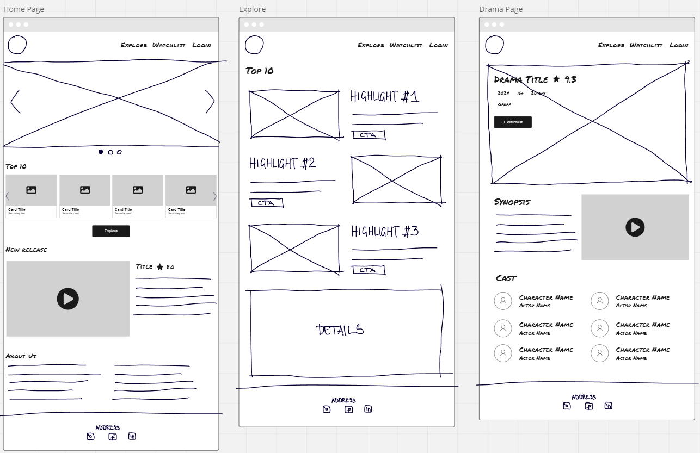
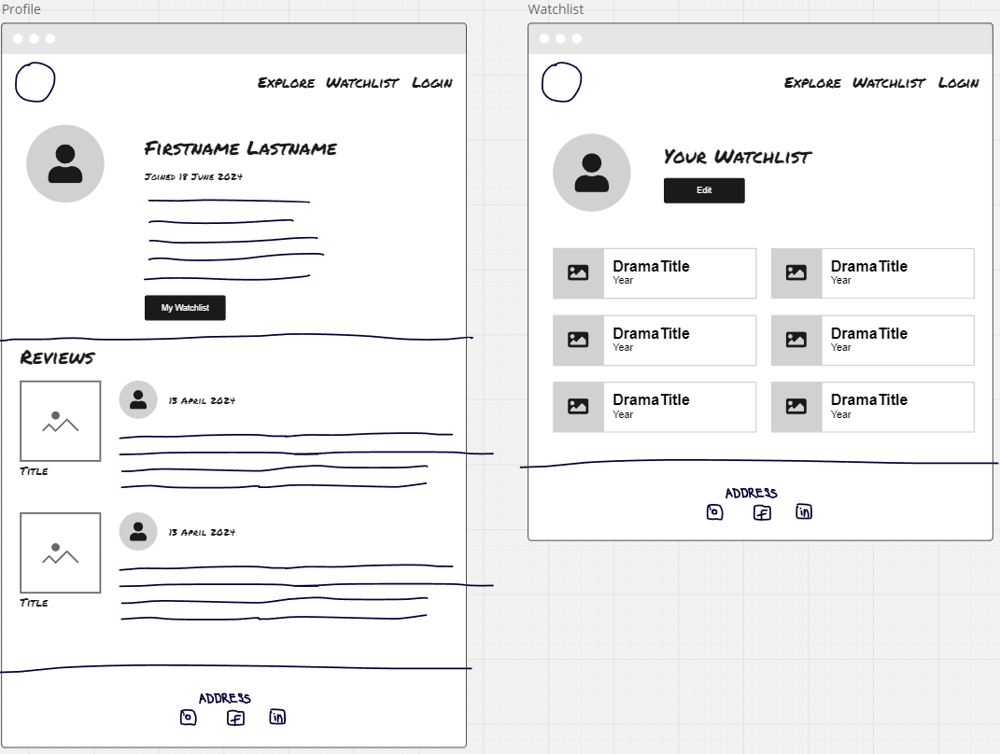
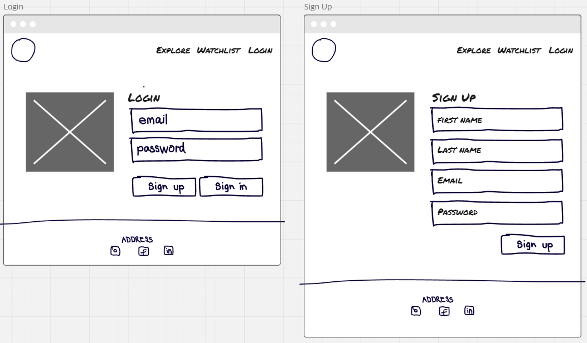
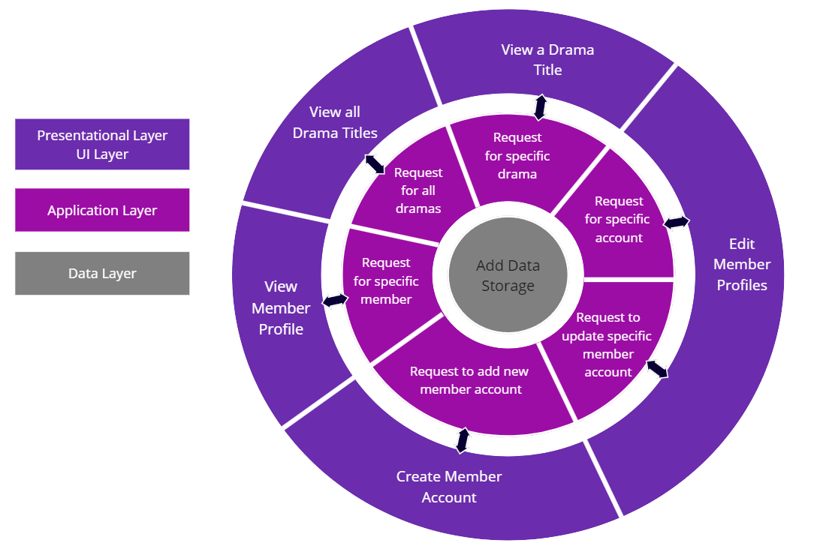

# Title: Drama Nexus

## Description

Drama Nexus is a database application tailored for Korean Dramas, where users can write or read reviews and give ratings on their favorite K-dramas. It caters to a niche market, making it easier for drama enthusiasts to find, share, and discuss shows, fostering a focused and vibrant community.

## Context

Finding the right K-drama to watch can often be a time-consuming and overwhelming task. Sifting through endless synopses and information to choose the next series to binge on can feel like a chore. Drama Nexus addresses this problem by offering a streamlined, community-driven platform for discovering and exploring Korean dramas.

Our platform helps both newcomers and enthusiasts by providing a list of highly reviewed shows and enabling searches based on genres, new releases, or user interests. For those feeling adventurous, a "Random Pick" button can suggest a show, encouraging users to step out of their comfort zone.

By creating a profile, users can add their reviews and ratings, guiding others in their viewing choices and fostering a supportive community. Members can maintain a private watchlist, bookmarking shows for future viewing, and engaging in discussions with like-minded fans.

Drama Nexus focuses on:

- **Ease of Finding Shows:** Quickly discover new or favourite dramas.
- **Community-Driven Recommendations:** Highlight the best dramas based on genuine community feedback.
- **Niche Market Focus:** Cater specifically to K-drama enthusiasts without the distraction of unrelated content.
- **Succinct Information Consolidation:** Present all necessary information about K-dramas in an easily digestible format.
- **Streaming Availability:** Provide information on where to watch each drama, saving users time.

By promoting a space for cultural exchange, Drama Nexus allows users from different countries to explore and appreciate K-dramas, fostering cross-cultural understanding and appreciation.

## General Application Features and Requirements

A list of features Drama Nexus will provide include:

- A user would be able to use the search bar on the home page or navigation bar to search of titles of latest k-dramas.
- A user should be able to log on using their email address and a password.
- The home page should have a slider which shows the top 10 dramas for this month based on ratings. This list would update at the beginning of every month.
- The application would include a "Random Pick" button that returns a single tv series to suggest to the user.
- The application should be user role-based access control and authenticate each request via an authentication service which verifies a token sent with the request and the role of the user
- The application should use several different services to process a user's request dependent on the request URL
- Unauthorised requests should return a 401 status code and display a friendly message to the user
- Backend services should only accept requests from designated front-end servers and not accept requests from any other source
- All data received at a backend service should be authenticated and then validated before being processed with a 403 status code returned if the data is invalid
- The application should look good on all devices and be accessible to all users.

## Future Abilities Roadmap:

- **Bio Pages for actors:** Profile pages for actors with links to dramas they feature in and news articles they feature in.
- **More like this recommendations:** By analyzing user reviews and ratings, Drama Nexus can offer personalized recommendations tailored to individual preferences, improving user satisfaction and engagement.
- **Expansion into other Asian dramas from different countries:** The database would grow to include other Asian dramas, such as C-Dramas, J-Dramas and Taiwanese dramas, into the list for users to search up information on.
- **Group Chats:** Being able to create small groups users can join and partake in group chats where they can discuss the episode/drama.
- **News Outlet:** Drama Nexus will hire moderators who will be able to repost blog posts based on popular titles and add any celebrity news from reputable publications to the website.
- **Discord Bot:** Features including:
  - Generate top 10 lists with varying filters,
  - Random drama watch roulette,
  - Add Discord connect to Drama Nexus account so bot can display user watchlist,
  - Plus varying other features...

### Features For Logged in Users

- Users will be able to add a personal star rating on each drama in the collection.
- Users will be able to view and edit their watchlist by saving a drama title from the drama page, and remove them from their watchlist page.
- Users will be able to login and create their own personal profiles. As well as view and edit their profile information.

#### View and Edit Profile

- On viewing their editable profile information, a profile view should be displayed and an "Edit Profile" button that will display a form with editable fields to update their information.
  - Non-editable fields should be displayed in form input fields but changes to the input should remain disabled.
  - Editable fields should be validated during edit and any validation errors should be clearly displayed to the user.
  - There should be a "Submit Profile Changes" button that will validate the form and send the data to the Member Profile Service.
  - Once the update has been successfully processed, the profile page should be shown, a success message should be displayed to the user and the "Edit Profile" button being displayed again.

### Features For Admin Users

- Admin users will be able to add new drama titles in the collection.
- Admin users will be able to edit drama details.
- Admin users will have the same access as regular members.

#### View and Edit Drama Title

- On viewing editable drama information, a drama profile view should be displayed and an "Edit Drama Title" button that will display a form with editable fields to update the information
  - Non-editable fields should be displayed in form input fields but changes to the input should remain disabled
  - Editable fields should be validated during edit and any validation errors should be clearly displayed to the admin user
  - There should be a "Submit Changes" button that will validate the form and send the data to the Drama Profile Service
  - Once the update has been successfully processed, the admin user is shown the updated drama profile, a success message should be displayed to the admin user and the "Edit Profile" button being displayed again

## API

I plan to use an API to compile an initial list of K-dramas from the site. I have found a few APIs that return lists of TV shows and movies, however the data would need to be filtered and mapped to return all the information I require and for lists of dramas that originated from Korea. After exploring different options and the examples below, The MovieDB API emerged as the best choice for sourcing comprehensive data on Korean dramas and provides what I need at the moment.

**TMDB**  
https://developer.themoviedb.org/  
The Movie Database, a definitive list of movie, tv, actor and image API. They have a vast database of TV and movies but navigating the information is hard and would require filtering to return suitable data.

_Example snippet of TV shows:_

```json
{
  "page": 1,
  "results": [
    {
      "adult": false,
      "backdrop_path": "/tdlHJ8KoOd9UgUygCWQ3fKRNkAR.jpg",
      "genre_ids": [18],
      "id": 91239,
      "origin_country": ["US"],
      "original_language": "en",
      "original_name": "Bridgerton",
      "overview": "Wealth, lust, and betrayal set in the backdrop of Regency era England, seen through the eyes of the powerful Bridgerton family.",
      "popularity": 2678.701,
      "poster_path": "/luoKpgVwi1E5nQsi7W0UuKHu2Rq.jpg",
      "first_air_date": "2020-12-25",
      "name": "Bridgerton",
      "vote_average": 8.132,
      "vote_count": 2562
    },
    {
      "adult": false,
      "backdrop_path": "/sQTyBUMfaTGDmwTofvY3jbSv2BP.jpg",
      "genre_ids": [18, 9648, 35],
      "id": 236033,
      "origin_country": ["CN"],
      "original_language": "zh",
      "original_name": "墨雨云间",
      "overview": "This drama tells the story of Xue Fangfei, the daughter of a well-off county magistrate who lost everything after a major upheaval. Saved by Jiang Li, the daughter of the Secretariat Director, she took on the identity of Jiang Li and returned to the capital. With the help of Duke Xiao Heng and others, she overcame numerous hardships, tirelessly fought against injustice, rescued her father who had been wrongly imprisoned, assisted Xiao Heng in upholding justice, protected the common people, and ultimately regained a beautiful life.",
      "popularity": 2512.812,
      "poster_path": "/2tZoc93g8DXTWbQjj328xCb9Ei7.jpg",
      "first_air_date": "2024-06-02",
      "name": "The Double",
      "vote_average": 7,
      "vote_count": 1
    },
    {
      "adult": false,
      "backdrop_path": "/hpZ5VJP1MvQjuFUMORuAoDFAH30.jpg",
      "genre_ids": [35, 10766, 10759],
      "id": 222289,
      "origin_country": ["BR"],
      "original_language": "pt",
      "original_name": "Família é Tudo",
      "overview": "Five half-siblings – Venus, Andromeda, Jupiter, Electra, and Plutao – share the same father, Pedro. Separated by their respective mothers after Pedro's death, the quintet have had few social and intimate interactions since. Years later, now adults, they reunite when their millionaire grandmother disappears on a cruise and is presumed dead. To earn their inheritance, they will have to live and work together for a year in an attempt to bring the family business back to its peak. If they don't succeed, the inheritance will go to their cousin, Hans, who will do anything to get the money from his aunt.",
      "popularity": 1812.933,
      "poster_path": "/tDbJuSfVhf3ZnxiJrXlXEALyAz5.jpg",
      "first_air_date": "2024-03-04",
      "name": "Family and Everything",
      "vote_average": 6.4,
      "vote_count": 5
    },
    {
      "adult": false,
      "backdrop_path": "/vSrR7pq1wtPw85XpiOrdNcYdtUb.jpg",
      "genre_ids": [18],
      "id": 239526,
      "origin_country": ["ES"],
      "original_language": "es",
      "original_name": "Sueños de libertad",
      "overview": "",
      "popularity": 1806.214,
      "poster_path": "/95RVeMWMvk97PBW0msryIJC32XD.jpg",
      "first_air_date": "2024-02-25",
      "name": "Sueños de libertad",
      "vote_average": 6,
      "vote_count": 10
    }
  ]
}
```

**MyDramaList**  
https://mydramalist.github.io/MDL-API/

This is from a site that releases up-to-date K-Dramas news, exclusives, and gossips. They have a comprehensive database of Korean dramas, movies, TV shows, and variety TV. However their api platform is not open to the public and require beta access. Therefore I believe I won't be able to have access to this api during this project.

## Caching

Due to the large quantity of data and similar information returned to the user, implementing caching is a must. This will be cached in local storage with an expiry set.

This solution for example, could be used to store the Top10 data as this wouldn't update as often and would mean the site loads faster, an expiry based on the frequency of data change will be applied. By implementing a local caching mechanism, I can significantly reduce the number of API calls, improve the application's performance, and provide a better user experience.

### Data Model for any user

```json
{
  "id": "MongoDB ObjectID",               // Auto-allocated by MongoDB - non-editable
  "name": {
    "firstName": "String",                // validated by a suitable regular expression - editable
    "lastName": "String"                  // validated by a suitable regular expression - editable
  },
  "email": "String",                      // validated by a suitable regular expression - unique and non-editable
  "password": "String",                   // hashed and salted using a suitable algorithm (e.g bcrypt) - editable
  "role": "String",                       // String of "Member" or "Admin"
  "created": "Date"                       // date of when the account was created - non-editable
}
```

### Data Model for a user profile

```json
{
  "id": "MongoDB ObjectID",               // Auto-allocated by MongoDB - non-editable
  "user": "Reference",                    // Reference to a user in users collection
  "profilePicture": "String",             // must link to an image file name - editable
  "watchlist": ["Reference"],             // Array of referenced entries in drama collection
  "reviews": ["Reference"]                // Array of referenced entries in review collection
}
```

### Data Model for reviews

```json
{
  "id": "MongoDB ObjectID",               // Auto-allocated by MongoDB - non-editable
  "author": "Reference",                  // Reference to entry in user collection - non-editable
  "stars": "Integer",                     // Integer of the star rating user gave the drama - editable
  "title": "String",                      // String of review title - editable
  "description": "String",                // String of review comment (optional) - editable
}
```

### Data Model for a drama - Profile Information

```json
{
  "id": "MongoDB ObjectID",               // Auto-allocated by MongoDB - non-editable
  "title": "String",                      // String of drama title - editable
  "year": "Integer",                      // Integer of the year title was released, to help know which title - editable
  "image": "String",                      // link to image file of drama used as main image - editable
  "synopsis": "String",                   // String of drama title synopsis
  "cast": [                               // Array of referenced entries in actor collection
    {
      "actor": "Reference",
      "role": "String"
    }
  ],
  "reviews": ["Reference"]                // Array of referenced entries in review collection
}
```

### Data Model for actors

```json
{
  "id": "MongoDB ObjectID",               // Auto-allocated by MongoDB - non-editable
  "image": "String",                      // String of image url
  "firstName": "String",                  // String of actor first name
  "lastName": "String"                    // String of actor last name
}
```

## User Interface

### Home, Explore, Drama Profile Page

**Home:** Main landing page when users first enter the site, holds carousel of latest/popular dramas, top 10 drama list, new release/highlight drama and small about us section.  
**Explore Page:** More insight into Top 10 list with detailed cards with short synopsis of drama.  
**Drama Profile Page:** Profile page for dramas, listing detailed synopsis of drama, more details and also cast list. Reviews from users are also shown here.



### Member Profile Pages

**Member Profile Page:** Detailed profile page of member which shows their name, when they joined and also their reviews of drama titles.  
**Member Watchlist Page:** List of mini cards of dramas that user has added to their to watch list.



### Login & Sign Up Form

**Login Page:** Form capturing email and password of member.  
**Sign Up Page:** Form capturing basic information to create a member account.



## Architecture

The application will adopt a N-Tier Architecture. The user interface will communicate with the MongoDB database with the Express Rest API via controller and service layers.



## RESTful Routing

The RESTful routes the project will have include:

**User Routes**

```bash
HTTP Method: GET
Route: /members
Headers: N/A
Payload: N/A
Response:
  Status Code: 200 OK
  Body: [{User profile entries}]
```

```bash
HTTP Method: GET
Route: /members/:id
Headers: N/A
Payload: N/A
Response:
  Status Code: 200 OK
  Body: {User profile entry}
```

**User Auth Routes - Member**

```bash
HTTP Method: POST
Route: /sign-up
Headers: N/A
Payload: {{name:{ firstName: firstName, lastName: lastName}}, email, password}
Response:
  Status Code: 201 Created
  Body: {User entry}
```

```bash
HTTP Method: POST
Route: /login
Headers: x-access-token: jwt
Payload: {email, password}
Response:
  Status Code: 200 OK
  Body: {User entry, Token}
```

```bash
HTTP Method: PUT
Route: /members/:id
Headers: x-access-token: jwt
Payload: {name, email, oldPassword, newPassword, profilePicture}
Response:
  Status Code: 200 OK
  Body: {User profile entry}
```

```bash
HTTP Method: POST
Route: /drama/:id/review
Headers: x-access-token: jwt
Payload: {author, stars, title, description}
Response:
  Status Code: 201 Created
  Body: {message}
```

```bash
HTTP Method: PUT
Route: /drama/:id/review
Headers: x-access-token: jwt
Payload: {review id, author, stars, title, description}
Response:
  Status Code: 200 Ok
  Body: {message}
```

```bash
HTTP Method: DELETE
Route: /drama/:id/review
Headers: x-access-token: jwt
Payload: {review id}
Response:
  Status Code: 200 Ok
  Body: {message}
```

```bash
HTTP Method: GET
Route: /members/:id/watchlist
Headers: x-access-token: jwt
Payload: {id}
Response:
  Status Code: 200 OK
  Body: [{Drama entry}]
```

```bash
HTTP Method: POST
Route: /member/:id/watchlist
Headers: x-access-token: jwt
Payload: {Drama entry id}
Response:
  Status Code: 200 Ok
  Body: {message}
```

```bash
HTTP Method: PATCH
Route: /member/:id/watchlist
Headers: x-access-token: jwt
Payload: {Drama entry id}
Response:
  Status Code: 200 Ok
  Body: {message}
```

**Drama Title Routes**

```bash
HTTP Method: GET
Route: /
Headers: N/A
Payload: N/A
Response:
  Status Code: 200 OK
  Body: [{drama entry}]
```

```bash
HTTP Method: GET
Route: /drama/:id
Headers: N/A
Payload: N/A
Response:
  Status Code: 200 OK
  Body: {drama entry}
```

**Drama Title Auth Routes**

```bash
HTTP Method: POST
Route: /drama/add
Headers: x-access-token: jwt
Payload: {title, synopsis, year, image, cast}
Response:
  Status Code: 201 Created
  Body: {drama entry}
```

```bash
HTTP Method: PUT
Route: /drama/:id
Headers: x-access-token: jwt
Payload: {title, year, image}
Response:
  Status Code: 200 OK
  Body: {drama entry}
```

## Technologies

**Frontend:**

- ReactJS
- Tailwind
- Vite
- Axios
- **Testing:**
  - Vitest
  - React Testing Library
  - Istanbul

**Backend:**

- Node.js
- NodeMailer
- Express.js
- ExpressValidator
- MongoDB
- Mongoose
- Cors
- Bcrypt
- JsonWebToken
- **Testing:**
  - Mocha
  - Chai
  - Sinon
  - C8

## Deployment

The project will be deployed with Netlify and MongoDB Atlas.
